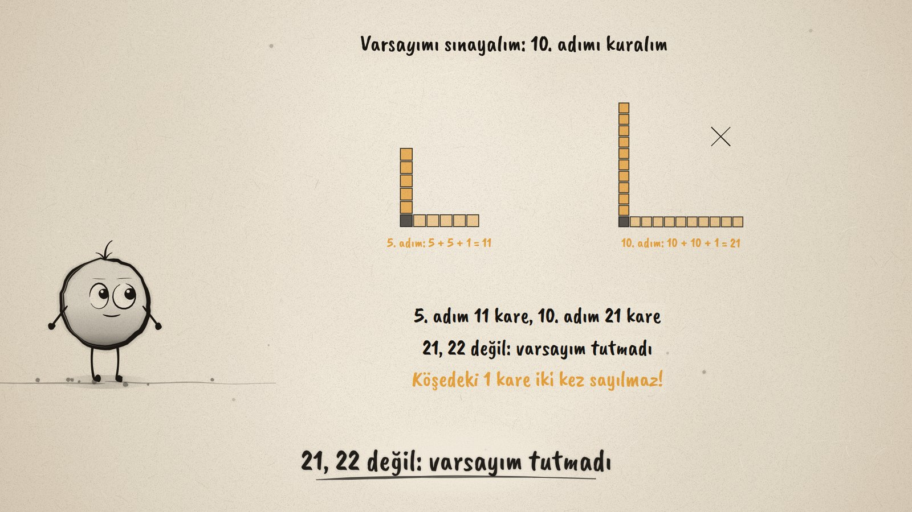
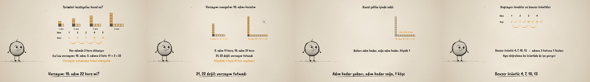

# Örüntünün Kuralı · The Rule of a Pattern

**▶ Tarayıcıda izleyin / Watch in the browser:** https://hakanatas.github.io/oruntunun-kurali/ 
**⬇ MP4 + altyazılar / MP4 + subtitles:** [Releases](https://github.com/hakanatas/oruntunun-kurali/releases) 
**✎ Kullanılan istem / The prompt behind it:** [PROMPT.md](PROMPT.md) 
**🎞 Bütün filmler / All films:** [Nokta'nın Filmleri](https://hakanatas.github.io/nokta-filmleri/?sinif=5)

> **TR —** 5. sınıf matematik "İşlemlerle Cebirsel Düşünme" temasındaki MAT.5.2.3 öğrenme çıktısı için hazırlanmış, tamamen JavaScript ile çizilen 92 saniyelik mürekkep animasyonu. Karelerle büyüyen bir L örüntüsü: 3, 5, 7, 9 kare. Terimler tabloya yazılınca her adımda 2 kare eklendiği görülüyor. Ece'nin varsayımı: 10. adım, 5. adımın 2 katıdır (11 × 2 = 22). Varsayım 10. adım kurularak sınanıyor: 10 + 10 + 1 = 21 kare, 22 değil; köşedeki kare iki kez sayılmaz. Kural şeklin içinde bulunuyor (yukarı adım kadar, sağa adım kadar, köşede 1) ve önerme olarak yazılıyor: kare sayısı = 2 × adım sayısı + 1; bu sayede 100. adım (201) çizmeden bulunuyor. Kural kapsayıcı örneklerle (1. adım 3, 7. adım 15) doğrulanıyor ve aynı doğrulama benzer bir örüntüye (4, 7, 10, 13: adımın 3 katının 1 fazlası) uygulanıyor. Altyazılar Türkçe, İngilizce ya da ikisi birlikte seçilebilir.

A 92-second ink animation for **5th-grade maths**. Nokta, the ink character from [The Learning Ink](https://github.com/hakanatas/the-learning-ink), is the guide again. Every L is drawn by one function from its step number (`ell` in `scenes/scene1.js`), coloured in three parts (the upright arm, the arm to the right, the corner), so the rule 2 × n + 1 can be read straight from the colours.

## Learning outcome

MEB, Türkiye Yüzyılı Maarif Modeli, Ortaokul Matematik, 5th grade, "İşlemlerle Cebirsel Düşünme" theme:

**MAT.5.2.3. Sayı ve şekil örüntülerinin kuralına ilişkin muhakeme yapabilme**
- a) Örüntülerdeki ilişkilere yönelik varsayımda bulunur.
- b) Varsayıma yönelik örüntüdeki terimleri inceleyerek örüntünün kuralına ilişkin genellemeleri belirler.
- c) Genellediği ilişkilerin varsayımını karşılayıp karşılamadığını sınar.
- ç) Varsayımı ile ilgili ulaştığı sonuca yönelik doğrulayabileceği önermeyi sözel ve sembolik temsiller kullanarak sunar.
- d) Sunduğu önermenin kullanışlılığına yönelik gerekçeler sunar.
- e) Sunduğu önermenin geçerliliğini destekleyen kapsayıcı örnekler verir.
- f) İşe koştuğu doğrulamanın benzer önermelere uygulanıp uygulanamayacağını değerlendirir.

## Scenes

| # | Time | Scene | What happens | Outcome |
|---|---|---|---|---|
| 1 | 0–10 s | Büyüyen L | 3, 5, 7, 9 squares. | a |
| 2 | 10–28 s | Terimleri incele | A table with +2 each step; the guess "step 10 = 2 × step 5 = 22". | a, b |
| 3 | 28–46 s | Varsayımı sına | Steps 5 and 10 built: 11 and 21; the corner is not counted twice. | c |
| 4 | 46–64 s | Kural | Up by the step, right by the step, 1 corner: 2 × step + 1; step 100 is 201. | ç, d |
| 5 | 64–80 s | Örnekler | Steps 1 and 7 check out; the same check works for 4, 7, 10, 13. | e, f |
| 6 | 80–92 s | Aklında kalsın | Examine, test, state the rule, check it. | a–f |

## Running it

- **Preview:** double-click `index.html` (it works offline).
- **MP4:** run `npm install` once, then `npm run export -- --format=horizontal --captions=tr`.
- **Subtitles and narration:** `npm run srt` writes `out/captions_*.srt` and `narration_notes.txt`.
- **Editing:**
  - Caption text, timings and narration notes: `captions.js`
  - Everything on screen is drawn by `LI.world(t)` in `scenes/scene1.js` (the L shapes, the tables, the words); the other scenes only set the camera.
  - Nokta's poses: `src/draw/film.js`; layout for 16:9 and 9:16: `src/draw/kd.js`

It uses the same engine as The Learning Ink: `renderFrame(t)` as a pure function of time, seeded randomness, and frame-by-frame export.

## Lisans · License

**TR —** Bu film ve kodu [Creative Commons Atıf-GayriTicari 4.0 Uluslararası (CC BY-NC 4.0)](https://creativecommons.org/licenses/by-nc/4.0/deed.tr) lisansıyla paylaşılır. Ticari olmayan her amaçla (derste, okulda, eğitim materyalinde) kopyalayabilir, paylaşabilir ve değiştirebilirsiniz; ancak **kaynak göstermek zorunludur**: eser sahibinin adı ve bu deponun bağlantısı belirtilmeden kullanılamaz. Ticari kullanım (satış, ücretli ürün ya da yayın) için izin alınmalıdır.

**EN —** This film and its code are licensed under [Creative Commons Attribution-NonCommercial 4.0 International (CC BY-NC 4.0)](https://creativecommons.org/licenses/by-nc/4.0/). You may copy, share and adapt them for non-commercial purposes, but **attribution is required**: they may not be used without crediting the author and linking to this repository. Commercial use requires permission.

Atıf örneği / Required credit: *“Örüntünün Kuralı”, Hakan Ataş, Nokta'nın Filmleri — https://github.com/hakanatas/oruntunun-kurali — CC BY-NC 4.0*
